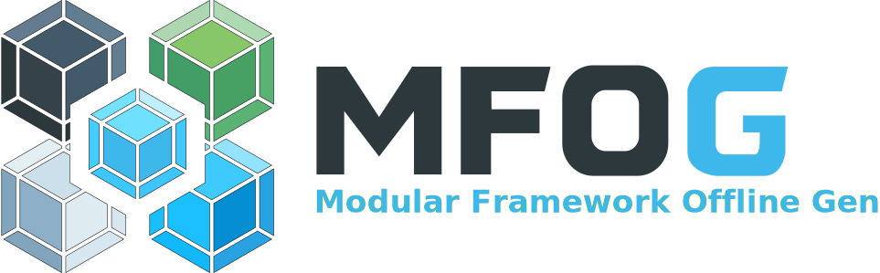

<div align="center">

  <!-- Logo -->
  <picture style="display: block; margin-top: 15px;">
    <source media="(prefers-color-scheme: dark)" srcset="assets/logo/mfog-logo-dark.svg">
    <source media="(prefers-color-scheme: light)" srcset="assets/logo/mfog-logo-light.svg">
    
  </picture>

  <!-- Tagline -->
  <h3 style="margin: 10px 0 20px 0; font-weight: 600;">
    Fast offline project generator for modern web apps
  </h3>

  <!-- Badges -->
  <p style="margin: 10px 0 5px 0;">
    <!-- Primary badges -->
    <a href="https://nodejs.org/"></a>
    <a href="LICENSE"></a>
    <a href="https://www.npmjs.com/package/@dmsudev/mfog"></a>
  </p>

  <p>
    <!-- Secondary badges -->
    <a href="https://reactjs.org/"></a>
    <a href="https://vuejs.org/"></a>
    <a href="https://angular.io/"></a>
    <a href="https://nextjs.org/"></a>
  </p>

</div>

## Table of Contents

- [Table of Contents](#table-of-contents)
- [Overview](#overview)
- [CLI Installation](#cli-installation)
- [Create a project](#create-a-project)
- [Project structure](#project-structure)
- [Development](#development)
- [Frameworks](#frameworks)
- [Roadmap](#roadmap)
- [License](#license)

## Overview

**MFOG** is an offline CLI generator for modern web applications.

It allows you to scaffold projects using prebuilt local templates, without requiring an internet connection or downloading external boilerplates.

This makes project creation easy for environments with limited connectivity or for users who prefer a faster setup process.

<p align="center">
  
</p>

> [!NOTE]
> This project is inspired by CRAO (Create React App Offline) by Baronsindo.
>
> 🔗Original repository: https://github.com/Baronsindo/create-react-app-offline/tree/master

## CLI Installation

Install MFOG globally via npm:

```sh
npm install -g @dmsudev/mfog
```

Once installed, the `mfog` command will be available in your terminal.

> [!NOTE]
> If you had the deprecated package `modular-framework-offline-generator` previously installed, uninstall it first:
>
> ```bash
> npm uninstall -g modular-framework-offline-generator
> ```

## Create a project

Run the CLI:

```sh
mfog
```

You will be prompted for a project name, and MFOG will generate a new directory with a ready-to-use project structure.

It includes:

- Project scaffold (React / Vue / Angular / Next.js)
- Preconfigured files
- Local dependency setup (fully offline)

## Project structure

After generation, move into your project:

```sh
cd your-project-name
```

## Development

Inside the newly created project, you can run:

```sh
npm run dev
```

This starts the development environment so you can begin working on your application.

If you created a **Vue.js** or **Next.js** project, you need to run the following command:

```sh
npm start
```

## Frameworks

- 🟢 Vue `v3.5.26`
- 🔵 React `v19.2.0`
- 🔴 Angular `v21.1.0`
- ⚫ Next.js `v16.1.1`

## Roadmap

- [x] Offline local templates
- [x] React, Vue, Angular, Next.js support
- [ ] Offline cache system to replace bundled templates and reduce package size

## License

This project is licensed under the **MIT License**.<br>
See the [LICENSE](LICENSE) file for more information.

Thanks for checking out **MFOG**! ❤️<br>
